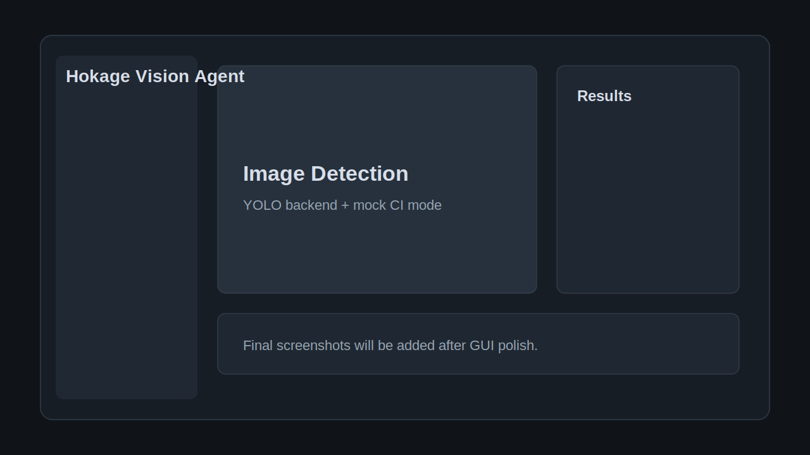

# Hokage Vision Agent

[](https://github.com/Phoenix0531-sudo/YOLOv5-PySide6_Hokage_Recognition/actions/workflows/ci.yml)
[](https://github.com/Phoenix0531-sudo/YOLOv5-PySide6_Hokage_Recognition/actions/workflows/gui-tests.yml)
[](https://github.com/Phoenix0531-sudo/YOLOv5-PySide6_Hokage_Recognition/actions/workflows/docker.yml)
[](https://github.com/Phoenix0531-sudo/YOLOv5-PySide6_Hokage_Recognition/actions/workflows/docs.yml)
[](https://github.com/Phoenix0531-sudo/YOLOv5-PySide6_Hokage_Recognition/actions/workflows/package.yml)
[](https://github.com/Phoenix0531-sudo/YOLOv5-PySide6_Hokage_Recognition/actions/workflows/desktop-build.yml)


An agentic computer vision workbench for anime character detection, powered by YOLO, PySide6, Docker, and tool-calling workflows.

This is a fan-made research and portfolio project and is not affiliated with Naruto, Shueisha, Pierrot, or related copyright holders.

[中文 README](README.zh-CN.md) · [Documentation](https://phoenix0531-sudo.github.io/YOLOv5-PySide6_Hokage_Recognition/)

## Features

- Shared detection types and inference service for CLI, GUI, API, and Agent workflows.
- Deterministic mock backend for CI, demos, and headless GUI tests without GPU or model downloads.
- PySide6 desktop GUI with image, video, batch, settings, statistics, and agent assistant panels.
- Rule-based Agent with allowlisted project tools and optional LLM provider placeholders.
- Dataset manifest, YOLO dataset validation, annotation assistance, smoke training, evaluation, and model comparison foundations.
- FastAPI service for health, model listing, mock detection, agent runs, dataset validation, smoke training, and model comparison.
- Docker-first development, CI, package build, desktop executable build, and MkDocs documentation.

## Screenshots

Placeholder screenshots live under `assets/screenshots/` until the final GUI capture pass.



## Docker-first Quick Start

```bash
docker compose build
docker compose run --rm test
docker compose run --rm gui-test
```

Start the API:

```bash
docker compose up api
```

Build docs, Python packages, and the Linux desktop executable:

```bash
docker compose run --rm docs
docker compose run --rm package
docker compose run --rm desktop-build
```

Docker is the primary workflow. Local Python installation is optional.

## Local Optional Install

```bash
python -m venv .venv
pip install -e ".[dev,gui,api,train]"
```

## GUI Demo

```bash
hokage-vision gui
```

The GUI defaults to the mock backend. Configure real weights through Settings or YAML config. Docker headless GUI tests are supported; Docker is not advertised as a zero-configuration way to display a real desktop GUI on every host.

## CLI Demo

```bash
hokage-vision --help
hokage-vision detect image examples/images/sample.jpg --backend mock
hokage-vision detect folder examples/images --backend mock
hokage-vision dataset validate configs/dataset.example.yaml
hokage-vision model compare --models models/a.pt models/b.pt --mock
```

## Agent Demo

```bash
hokage-vision agent run "检测 examples/images 里的图片"
hokage-vision agent run "检查数据集并给出训练建议"
```

The default agent is rule-based, does not require API keys, and only calls allowlisted project tools. It does not execute arbitrary shell commands or scrape copyrighted images.

## API Demo

```bash
docker compose up api
curl http://localhost:8000/health
```

OpenAPI docs are available at `http://localhost:8000/docs`.

## Dataset and Training Workflow

1. Record image sources and redistribution terms in a dataset manifest.
2. Validate YOLO dataset structure and labels.
3. Use annotation assistance only to generate review-required candidates.
4. Manually review annotations.
5. Run smoke training or a real training dry-run.
6. Execute real training only after explicit confirmation.
7. Register, evaluate, and compare models before release.

Adding a new character class requires new images, verified rights, bounding-box annotations, updated class names, dataset YAML changes, retraining or fine-tuning, evaluation, registry updates, and documentation updates.

## Project Structure

```text
src/hokage_vision/   Core package for config, vision, data, training, agents, API, and UI
apps/                Thin desktop and API entrypoints
configs/             Default app, model, agent, dataset, and training config
docs/                MkDocs static documentation site
tests/               Unit, integration, GUI, and packaging tests
models/              Local registry metadata and external weight placement notes
data/                Local data workspace with manifest and license guidance
```

## Architecture

The GUI, CLI, API, and Agent layers all call shared services. YOLO/CV backends perform detection. Agents only plan and orchestrate project-scoped tools.

## Roadmap

- Complete legacy source isolation under `legacy/old_project/`.
- Add real model release metadata after license and data review.
- Expand GUI polish and final screenshots.
- Harden real training, evaluation, and desktop packaging across platforms.

## License

New Hokage Vision Agent code is intended to be Apache-2.0. Legacy YOLOv5-derived code remains governed by the applicable upstream YOLOv5 license. Model weights, datasets, annotations, and documentation may have separate license terms. See `LICENSES/README.md` and `docs/license-audit.md`.

## Acknowledgements

This project builds on the Python, PySide6/Qt, FastAPI, Ultralytics/YOLO, Docker, MkDocs, and open source testing ecosystems.
