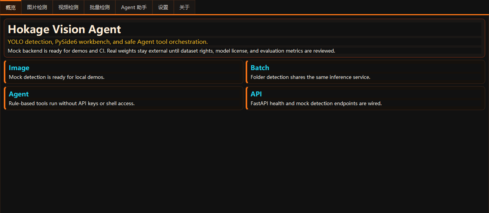
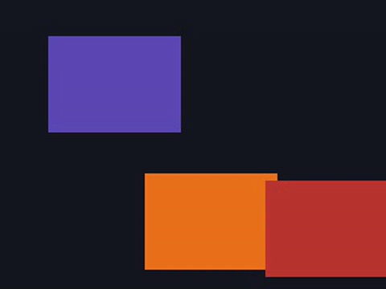
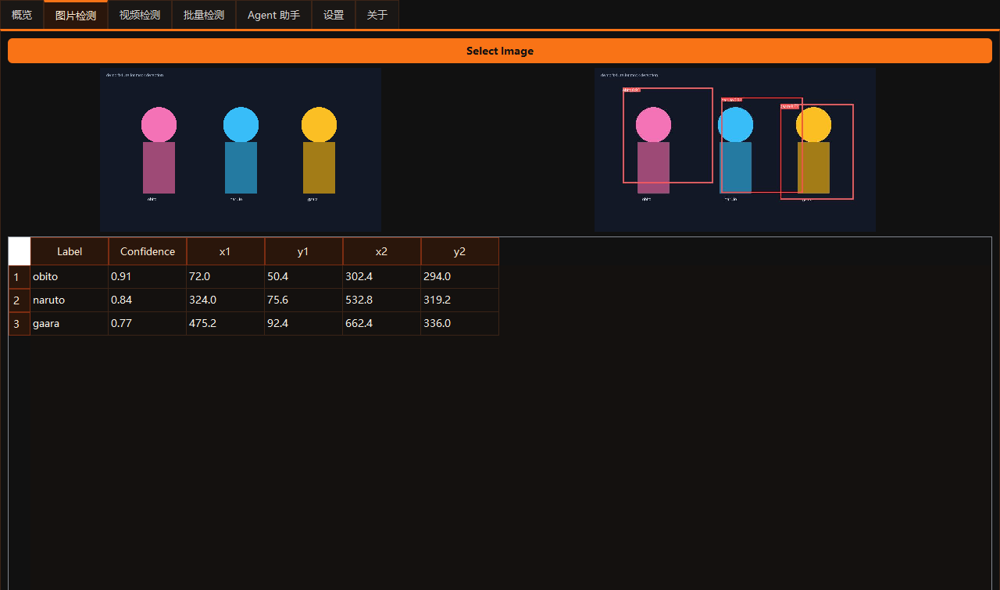
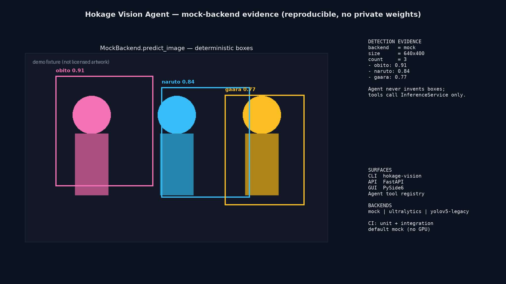
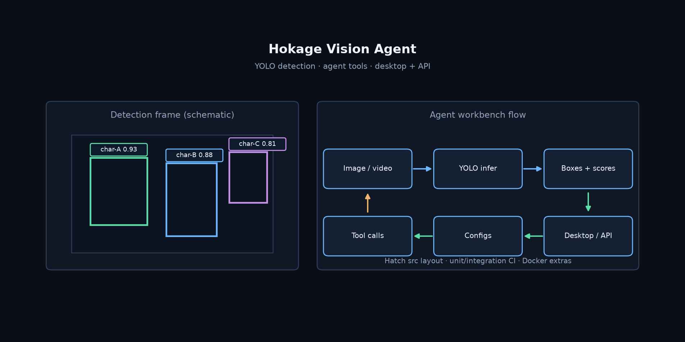

# Hokage Vision Agent

<p align="center">
  
</p>

**Agentic anime character detection workbench — YOLO backends, PySide6 desktop, FastAPI, Typer CLI, tool-calling agent.**

[English](README.md) | [中文](README.zh-CN.md)

[](https://github.com/Phoenix0531-sudo/Hokage_Vision_Agent/actions/workflows/ci.yml)
[](LICENSE)
[](pyproject.toml)
[](https://github.com/astral-sh/ruff)
[](.github/workflows/ci.yml)

Portfolio-grade CV workbench. Detection is performed by a **vision backend** (mock / Ultralytics / legacy YOLOv5). The **agent does not invent labels**; it only chooses safe project tools (detect, validate dataset, smoke train, evaluate, compare, registry updates).

## Why this project

- **Real LLM agent, not a wrapper.** Function-calling agent over 16 typed tools with three providers (rule-based / OpenAI / LangGraph), injectable clients so the whole agent loop is unit-testable offline. Safety layer refuses out-of-scope tasks before any LLM call.
- **ONNX-only CPU inference.** 12 MB model, no PyTorch at runtime, ~30 FPS on a laptop CPU (`hokage-vision model benchmark`).
- **Training closed loop in-repo.** Synthetic data → yolov8n fine-tune → ONNX export → real detection, one command, CPU-only, mAP50 0.995.
- **Engineering hygiene as a feature.** 160+ tests at 93% coverage with an 85% CI gate, 8 CI workflows, multi-OS desktop releases, GHCR image, MkDocs site.

## 🎮 Try it online (no install)

The bundled synthetic-shapes model runs in the browser on a free Hugging Face Space — upload an image, drag the confidence slider, get real ONNX detections:

**→ [Open the live demo](https://huggingface.co/spaces/phoenix0531-sudo/hokage-vision-agent)** *(deploy pending — see [`hf-space/`](hf-space/) for the ready-to-deploy app)*

The same Space app (`hf-space/app.py`) runs locally with `pip install -r hf-space/requirements.txt && python hf-space/app.py`.

## 30-second demo (works on a fresh clone)

Everything below ships in the repo — no downloads, no weights hunting:

```bash
python examples/quickstart.py        # mock pipeline: detect → validate → smoke train → agent → report
```

Want the real model instead of mock? It's bundled (the Ultralytics backend needs the `train` extra for ONNX Runtime):

```bash
pip install -e ".[dev,train]"      # adds ultralytics + onnxruntime (CPU wheels)
```

```bash
# unzip the bundled synthetic dataset, then run REAL inference with the bundled ONNX model
python -c "
import zipfile; from pathlib import Path
tmp = Path('runs/bundled-demo'); tmp.mkdir(parents=True, exist_ok=True)
zipfile.ZipFile('assets/demo/synthetic-shapes-dataset.zip').extractall(tmp)
"
hokage-vision detect image runs/bundled-demo/dataset/images/val/naruto_000.jpg \
  --backend ultralytics --model-path assets/demo/synthetic-shapes-yolov8n.onnx \
  --conf 0.5 --imgsz 320
# → {"label": "naruto", "confidence": 0.999}
```

<p align="center">
  
</p>

## Agent in action (tool-calling)

The agent plans over JSON-schema'd tools and executes them through the same `ToolRegistry` the CLI/API use — no parallel code paths:

```bash
hokage-vision agent run "批量识别 examples/images 文件夹里的目标"
# → tool_calls: detect_folder(examples/images) → status success, 1 image scanned

hokage-vision agent run "帮我写一篇小说"
# → Agent refused the task: it only handles this project's vision, data, annotation,
#   training, evaluation, model-management, and project-health tasks.
```

With `--provider openai` (or `langgraph`) the same registry is exposed to an
LLM as OpenAI-style function schemas — see `docs/usage.md`.

Docs site (MkDocs): <https://phoenix0531-sudo.github.io/Hokage_Vision_Agent/>

## Screenshots (real Qt grab)

<table>
  <tr>
    <td width="50%">
      
      <br><strong>Home overview</strong> — real PySide6 window (<code>MainWindow.grab()</code>)
    </td>
    <td width="50%">
      
      <br><strong>Image detection</strong> — mock boxes + results table (obito/naruto/gaara)
    </td>
  </tr>
  <tr>
    <td width="50%">
      
      <br><strong>Backend evidence figure</strong> — reproducible matplotlib card
    </td>
    <td width="50%">
      
      <br><strong>Architecture schematic</strong> — CLI / GUI / API → backends
    </td>
  </tr>
  <tr>
    <td width="50%">
      
      <br><strong>Closed-loop real detection</strong> — trained in-repo (synthetic data → yolov8n fine-tune → ONNX export → <code>UltralyticsBackend</code> + rendering), 24/24 val accuracy
    </td>
    <td width="50%">
      
      <br><strong>Real ONNX detection demo</strong> — bundled 12 MB model, CPU-only, no PyTorch at runtime
    </td>
  </tr>
</table>

```bash
# real window grab + mock detect on demo fixture
PYTHONPATH=src python scripts/capture_real_shots.py
PYTHONPATH=src python scripts/generate_evidence.py
```

Default demo classes: `obito`, `naruto`, `gaara` with confidences `0.91 / 0.84 / 0.77` — same mock path CI uses. No private YOLO weights required.

## Design boundaries

```
CLI / PySide6 GUI / FastAPI
        │
        ▼
 InferenceService  ◄── Agent tools (RuleBasedAgent + ToolRegistry)
        │
        ▼
 VisionBackend: MockBackend | UltralyticsBackend | YOLOv5LegacyBackend
        │
        ▼
 Dataset / Training / Model registry
```

- Shared core types and services across CLI, API, GUI, Agent
- Default backend is **`mock`**: deterministic boxes so CI and demos need no GPU or private weights
- Destructive / real training paths use careful / dry-run style entrypoints
- Legacy YOLOv5 stays behind a dedicated backend — do not copy legacy package guts into `src/hokage_vision`

## Package map (`src/hokage_vision`)

| Area | Role |
|------|------|
| `vision/` | Inference service, backends factory, evaluation, compare |
| `agents/` | Orchestrator, tool registry, safety, rule / OpenAI / LangGraph providers |
| `api/` | FastAPI app + routes + schemas |
| `cli.py` | Typer multi-command CLI (`hokage-vision`) |
| `data/` | YOLO dataset helpers, manifest, validation, split, annotation assist |
| `training/` | Trainer, smoke train, model registry |
| `config/` | YAML settings loader (`configs/*.yaml`) |
| `reports/` | Markdown report helpers |

Console script: `hokage-vision = hokage_vision.cli:main`.

### CLI surface

```text
hokage-vision detect ...
hokage-vision dataset ...
hokage-vision dataset manifest ...
hokage-vision annotation ...
hokage-vision train ...
hokage-vision model ...
hokage-vision agent ...
```

## Quickstart

One command runs the whole pipeline (detect, validate, smoke train, agent, report) with the deterministic mock backend — no GPU, no weights, no network:

```bash
python examples/quickstart.py
```

All artifacts land under `runs/quickstart/`. See [docs/quickstart.md](docs/quickstart.md) for the 60-second walkthrough.

Want the real thing instead of mock? One command trains a model in-repo and runs live inference through the same backends:

```bash
# synthetic data -> yolov8n fine-tune (CPU) -> ONNX export -> UltralyticsBackend detection
python scripts/closed_loop_demo.py --epochs 40
```

```text
[4/4] real inference on naruto_000.jpg:
  naruto  conf=1.00 box=(34,55,185,169)
closed loop complete.
```

The trained model reaches 24/24 val accuracy (see the [model card](models/model-card.synthetic-shapes.md)) and the detection figure ships in the README above.

## Install

Python **>= 3.12**. Hatchling src layout.

```bash
git clone https://github.com/Phoenix0531-sudo/Hokage_Vision_Agent.git
cd Hokage_Vision_Agent
python -m pip install -e ".[dev,api]"
# optional extras: gui, train (ultralytics), llm, desktop-build, docs, all
```

Docker-first path:

```bash
docker compose build
docker compose run --rm test
```

## Quick usage

```bash
python -c "import hokage_vision; print(hokage_vision.__version__)"
hokage-vision --help
hokage-vision detect --help

# CI default paths
pytest -q tests/unit tests/integration

# evidence figure
PYTHONPATH=src python scripts/generate_evidence.py
```

GUI and full training need corresponding extras and (for real weights) local files under `models/` — see `docs/usage.md` and `docs/data-and-models.md`.

## Config

- `configs/app.default.yaml` — mock backend default
- `configs/model.default.yaml`
- `configs/agent.default.yaml`
- `configs/dataset.example.yaml`, `configs/training.example.yaml`

## Tests and CI

| Layer | Location |
|-------|----------|
| Unit | `tests/unit/` — mock backend, inference, registry, agent tools, dataset, rendering, … |
| Integration | `tests/integration/` — API health, CLI detect mock, CLI help |
| GUI | `tests/gui/` — separate workflow |
| Packaging | `tests/packaging/` |

Product `CI` workflow: Python **3.12**, hard editable install `.[dev,api]`, critical ruff, pytest **unit + integration only** (GUI has its own workflow).

## Scope

- **In:** anime-character detection workbench, multi-surface UX (CLI/API/GUI), agent tool layer, dataset/train scaffolding, reproducible mock evidence
- **Out:** production content-moderation SaaS; guaranteed SOTA without your own training data; committing private YOLO weights

## License

Apache-2.0. See [LICENSE](LICENSE) and `THIRD_PARTY_NOTICES.md`.
