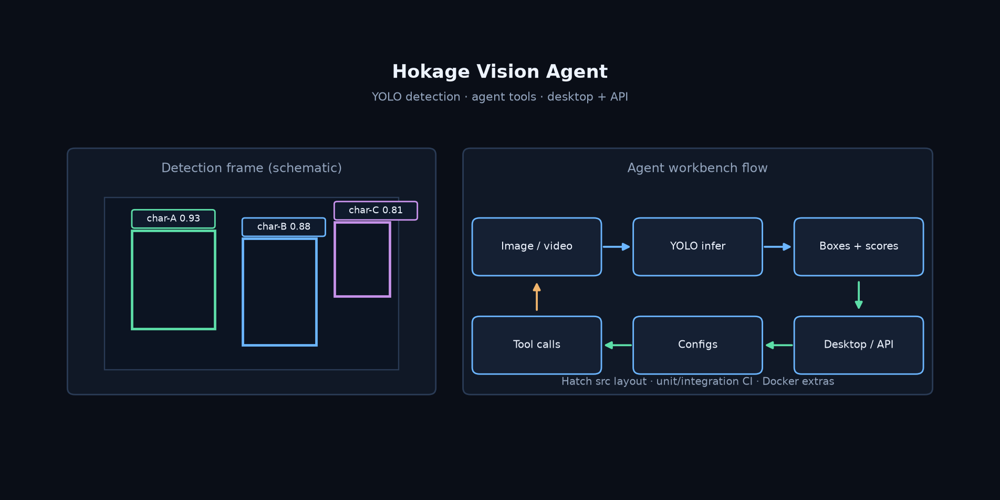

# Hokage Vision Agent

**Agent 风格动漫角色检测工作台 — YOLO 后端、PySide6 桌面、FastAPI、Typer CLI、可调用工具的 Agent。**

[English](README.md) | [中文](README.zh-CN.md)

[](https://github.com/Phoenix0531-sudo/Hokage_Vision_Agent/actions/workflows/ci.yml)
[](LICENSE)

作品集级 CV 工作台。**检测由 vision backend 完成**（mock / Ultralytics / 旧版 YOLOv5）。**Agent 不编造类别标签**，只选择安全的项目工具（检测、校验数据集、smoke 训练、评估、对比、注册表更新）。

文档站：<https://phoenix0531-sudo.github.io/Hokage_Vision_Agent/>

## 预览



## 设计边界

```
CLI / PySide6 GUI / FastAPI
        │
        ▼
 InferenceService  ◄── Agent 工具层
        │
        ▼
 Mock | Ultralytics | YOLOv5Legacy
```

- CLI / API / GUI / Agent 共享核心类型与服务
- 默认 **`mock` 后端**：无需 GPU / 私有权重即可跑通演示与 CI（示例类含 `obito` / `naruto` / `gaara`）
- 真实训练与破坏性操作走谨慎入口
- 旧 YOLOv5 隔离在专用 backend，不把 legacy 代码抄进新包

## 包地图（`src/hokage_vision`）

| 区域 | 作用 |
|------|------|
| `vision/` | 推理服务、backend 工厂、评估、对比 |
| `agents/` | 编排、工具注册、安全、rule/OpenAI/LangGraph |
| `api/` | FastAPI |
| `cli.py` | Typer CLI（`hokage-vision`） |
| `data/` | YOLO 数据集、manifest、校验、划分、标注辅助 |
| `training/` | 训练、smoke、模型注册表 |
| `config/` | YAML 配置加载 |

## 安装

Python **>= 3.12**。

```bash
git clone https://github.com/Phoenix0531-sudo/Hokage_Vision_Agent.git
cd Hokage_Vision_Agent
python -m pip install -e ".[dev,api]"
# 可选：gui / train / llm / desktop-build / docs / all
```

Docker（文档推荐主路径）：

```bash
docker compose build
docker compose run --rm test
```

## 快速使用

```bash
python -c "import hokage_vision; print(hokage_vision.__version__)"
hokage-vision --help
pytest -q tests/unit tests/integration
```

GUI / 真权重训练见 `docs/usage.md`、`docs/data-and-models.md` 与 `configs/`。

## CI

产品 CI：Python 3.12、可编辑安装 `.[dev,api]`、unit + integration。GUI / Docker / Package 等为独立 workflow。

## 范围

- **做：** 动漫角色检测工作台、多端入口、Agent 工具层、数据与训练脚手架  
- **不做：** 生产级内容审核 SaaS、无自有数据的精度承诺  

## 许可证

Apache-2.0。详见 [LICENSE](LICENSE)。
