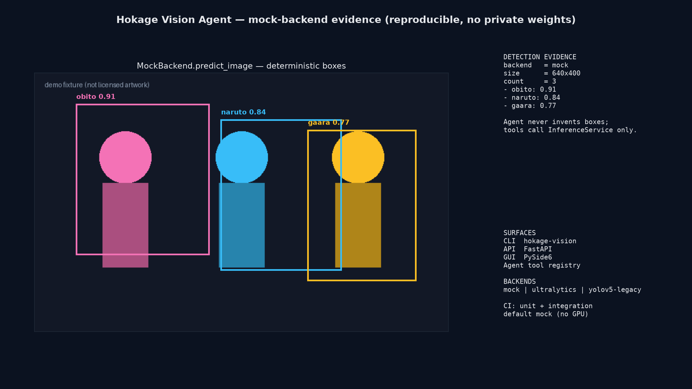

# Hokage Vision Agent

**Agent 风格动漫角色检测工作台 — YOLO 后端、PySide6 桌面、FastAPI、Typer CLI、工具调用 Agent。**

[English](README.md) | [中文](README.zh-CN.md)

[](https://github.com/Phoenix0531-sudo/Hokage_Vision_Agent/actions/workflows/ci.yml)
[](LICENSE)
[](pyproject.toml)

作品集级 CV 工作台。检测由 **vision backend** 完成（mock / Ultralytics / 旧版 YOLOv5）。**Agent 不编造标签**，只选择安全的项目工具（检测、校验数据集、smoke 训练、评估、对比、注册表更新）。

文档站：<https://phoenix0531-sudo.github.io/Hokage_Vision_Agent/>

## 截图 / 证据

<table>
  <tr>
    <td width="50%">
      
      <br><strong>Mock 检测证据</strong> — <code>MockBackend.predict_image</code> 确定性框
    </td>
    <td width="50%">
      
      <br><strong>架构示意图</strong> — CLI / GUI / API → InferenceService → backends
    </td>
  </tr>
</table>

```bash
PYTHONPATH=src python scripts/generate_evidence.py
```

默认演示类：`obito` / `naruto` / `gaara`，固定置信度与相对框 — 与 CI mock 路径一致，无需 GPU / 私有权重。

## 设计边界

- 默认 backend = **`mock`**，CI 与演示零权重
- 共享核心类型服务，CLI / API / GUI / Agent 共用
- 旧版 YOLOv5 独立 backend，不把 legacy 包拷进 `src/hokage_vision`

## 安装与快速用

```bash
git clone https://github.com/Phoenix0531-sudo/Hokage_Vision_Agent.git
cd Hokage_Vision_Agent
python -m pip install -e ".[dev,api]"
pytest -q tests/unit tests/integration
hokage-vision --help
```

Docker：

```bash
docker compose build
docker compose run --rm test
```

## 包结构

`src/hokage_vision/{vision,agents,api,cli,data,training,config,reports}`。  
控制台入口：`hokage-vision`。

## 测试与 CI

- 产品 CI：Python 3.12 + `pip install -e ".[dev,api]"` + unit/integration
- GUI / Docker / package / docs 为独立 workflow

## 范围

- **做：** 多表面检测工作台、Agent 工具层、数据集/训练脚手架、可复现 mock 证据
- **不做：** 内容审核 SaaS、无自有数据的 SOTA 保证、私有权重入库

## 许可证

Apache-2.0。见 [LICENSE](LICENSE) 与 `THIRD_PARTY_NOTICES.md`。
