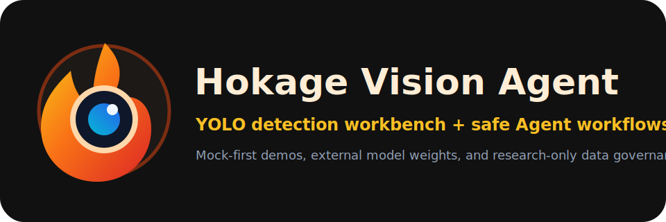
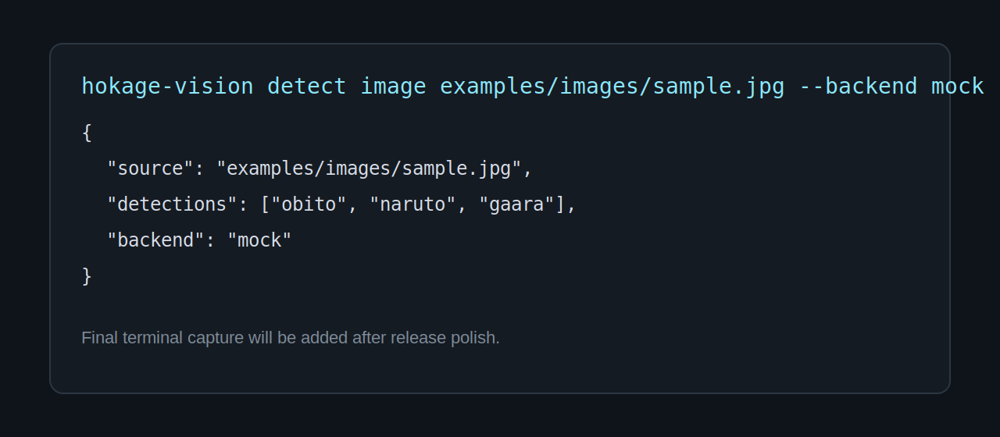

# Hokage Vision Agent

<p align="center">
  
</p>

[](https://github.com/Phoenix0531-sudo/Hokage-Vision-Agent/actions/workflows/ci.yml)
[](https://github.com/Phoenix0531-sudo/Hokage-Vision-Agent/actions/workflows/gui-tests.yml)
[](https://github.com/Phoenix0531-sudo/Hokage-Vision-Agent/actions/workflows/docker.yml)
[](https://github.com/Phoenix0531-sudo/Hokage-Vision-Agent/actions/workflows/docs.yml)
[](https://github.com/Phoenix0531-sudo/Hokage-Vision-Agent/actions/workflows/package.yml)
[](https://github.com/Phoenix0531-sudo/Hokage-Vision-Agent/actions/workflows/desktop-build.yml)


一个基于 YOLO、PySide6、Docker 与 Agent 工具编排的动漫角色检测工作台。

本项目是个人学习、研究与作品集展示项目，与《火影忍者》、集英社、Pierrot 或相关版权方无官方关联。

[English README](README.md) · [文档站](https://phoenix0531-sudo.github.io/Hokage-Vision-Agent/)

## 项目状态

Hokage Vision Agent 的定位是一个 **training-ready / model-ready 的计算机视觉工作台**。仓库发布的是工程平台本身：桌面 GUI、CLI、API、Agent 工具编排、数据集检查、辅助标注、训练 dry-run、模型注册、评估、打包、CI 和文档。

仓库不发布 Naruto/Hokage 截图、私有数据集或真实角色检测权重。原因不是功能缺失，而是这些资产必须先确认图片来源、再分发权限、模型许可证和非商用学习研究范围。公开 demo 使用 deterministic mock backend 和 tiny synthetic YOLO smoke dataset，因此不需要版权图片、GPU、私有数据或 API Key 也能完整验证工程链路。

## 功能亮点

- CLI、GUI、API、Agent 共用统一检测数据结构与推理服务。
- 默认 mock backend，无需 GPU、真实模型权重或私有数据即可跑通测试与演示。
- PySide6 桌面端包含图片检测、视频检测、批量检测、设置、统计与 Agent Assistant 页面。
- RuleBasedAgent 默认无 API Key 可运行，只能调用 allowlist 内的项目工具。
- 支持 synthetic smoke dataset、数据集 manifest、YOLO 数据集检查、辅助标注、训练 dry-run、模型评估与多权重对比骨架。
- FastAPI 提供健康检查、模型列表、mock 检测、Agent 调用、数据集检查、smoke training 和模型对比接口。
- Docker-first 开发、CI、GUI smoke tests、Python package、桌面可执行包与 MkDocs 文档站。

## 截图

作品集预览图位于 `assets/screenshots/`。这些是项目自制视觉素材，不包含 Naruto 截图或重新分发的动漫媒体。




## Docker-first 快速开始

```bash
docker compose build
docker compose run --rm test
docker compose run --rm gui-test
```

启动 API：

```bash
docker compose up api
```

构建文档、Python 包和 Linux 桌面可执行包：

```bash
docker compose run --rm docs
docker compose run --rm package
docker compose run --rm desktop-build
```

只有需要真实 YOLO 训练依赖时，才构建可选训练镜像：

```bash
docker compose --profile train build train
docker compose --profile train run --rm train
```

Docker 是主要入口，本地裸机安装只是可选开发方式。
Docker Compose 默认使用 Debian 镜像源来提高本地构建稳定性；如果你的网络环境更适合其他源，可以覆盖 `DEBIAN_MIRROR` 和 `DEBIAN_SECURITY_MIRROR`。

## 面试演示路径

面试或作品集展示时，最短可复现路径如下：

```bash
docker compose run --rm test hokage-vision dataset validate configs/dataset.example.yaml
docker compose run --rm test hokage-vision detect image examples/images/sample.jpg --backend mock
docker compose run --rm test hokage-vision agent run "训练模型"
docker compose run --rm gui-test pytest tests/gui -m gui
docker compose up api
```

推荐讲法：这个项目不虚假宣称发布了公开 Naruto 角色模型，而是展示围绕真实模型项目需要的工程能力：数据合规、模型可插拔推理、Docker 可复现验证、Agent 受控编排训练/评估/模型管理。

## 本地可选安装

```bash
python -m venv .venv
pip install -e ".[dev,gui,api,train]"
```

## GUI Demo

```bash
hokage-vision gui
```

GUI 默认使用 mock backend。真实权重通过 Settings 或 YAML 配置指定。Docker 支持 headless GUI tests，但不承诺所有系统都能零配置显示真实桌面窗口。

## CLI Demo

```bash
hokage-vision --help
hokage-vision detect image examples/images/sample.jpg --backend mock
hokage-vision detect folder examples/images --backend mock
hokage-vision dataset validate configs/dataset.example.yaml
hokage-vision train yolo --data configs/dataset.example.yaml --epochs 1 --dry-run
hokage-vision model compare --models models/a.pt models/b.pt --mock
```

## Agent Demo

```bash
hokage-vision agent run "检测 examples/images 里的图片"
hokage-vision agent run "检查数据集并给出训练建议"
```

Agent 只负责理解任务、选择工具、编排训练/评估/模型管理流程；视觉识别仍由 YOLO/CV 后端完成。Agent 不执行任意 shell，不自动爬取或重新分发版权图片。

## API Demo

```bash
docker compose up api
curl http://localhost:8000/health
```

OpenAPI 文档位于 `http://localhost:8000/docs`。

## 数据集与训练流程

1. 记录图片来源、许可证和是否允许再分发。
2. 使用 YOLO 数据集检查确认路径、标签、类别和 bbox 合法。
3. 辅助标注只生成候选框，并默认标记为需要人工审核。
4. 人工审核标注。
5. 先运行 smoke training 或真实训练 dry-run。
6. 只有用户明确确认后才执行耗时真实训练。
7. 训练后注册、评估并对比模型。

仓库内的 `examples/dataset/` 是 synthetic fixture，只用于证明数据检查和训练计划链路。真实角色模型需要用户提供或其他合法来源图片、人工审核标注，并将权重作为外部 artifact 管理。

扩展新角色类别必须准备新图片、确认授权、标注目标框、更新 class names 和 dataset yaml、重新训练或微调、重新评估、更新模型注册表和文档。Agent 不能凭空创造合法数据或高质量新类别能力。

## 项目结构

```text
src/hokage_vision/   配置、视觉、数据、训练、Agent、API、UI 核心包
apps/                桌面端和 API 的薄入口
configs/             默认应用、模型、Agent、数据集和训练配置
docs/                MkDocs 静态文档站
tests/               单元、集成、GUI、打包测试
models/              本地模型注册元数据和外部权重放置说明
data/                本地数据工作区与 manifest/license 约束
legacy/old_project/  已隔离的旧 YOLOv5 + PySide6 代码树，用于审计和兼容
```

## 架构

GUI、CLI、API 和 Agent 都调用共享服务层。YOLO/CV 后端负责检测；Agent 只在项目范围内做工具选择和流程编排。

## Roadmap

- 增加 Docker `train` profile，把真实训练依赖从默认测试镜像中隔离出来。
- 在外部权重经过审查后补充 model card 和 release metadata。
- 数据权利确认后补充真实评估报告和指标。
- 加强 Linux、Windows、macOS 的桌面打包稳定性。

## License

新写 Hokage Vision Agent 代码计划采用 Apache-2.0。旧 YOLOv5 派生代码遵循对应上游许可证。模型权重、数据集、标注和文档可能有独立许可证。详见 `LICENSES/README.md` 与 `docs/license-audit.md`。

## Acknowledgements

本项目基于 Python、PySide6/Qt、FastAPI、Ultralytics/YOLO、Docker、MkDocs 与开源测试生态构建。
