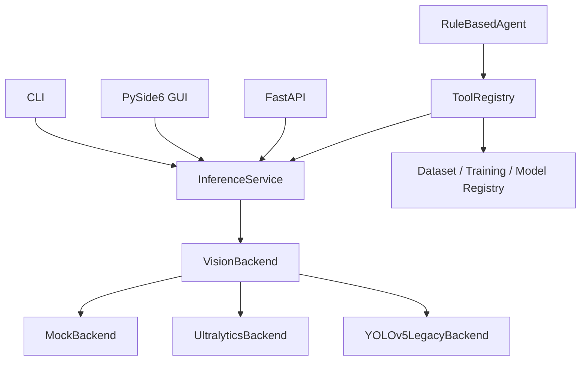

# Architecture

Hokage Vision Agent separates UI, orchestration, and computer vision execution.

The model backend performs detection. The Agent does not replace YOLO or decide visual labels; it only selects safe project tools such as detection, dataset validation, smoke training, evaluation, comparison, and model registry updates.

## Boundaries

- GUI, CLI, API, and Agent share core dataclasses and services.
- The default mock backend keeps CI independent from GPU and private weights.
- Real training and destructive operations default to dry-run.
- Legacy YOLOv5 compatibility remains behind `YOLOv5LegacyBackend` and must not be copied into the new package.
